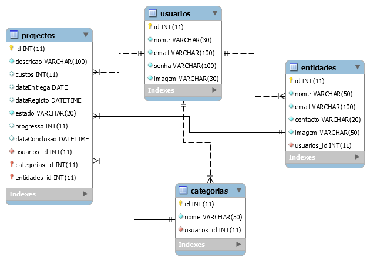
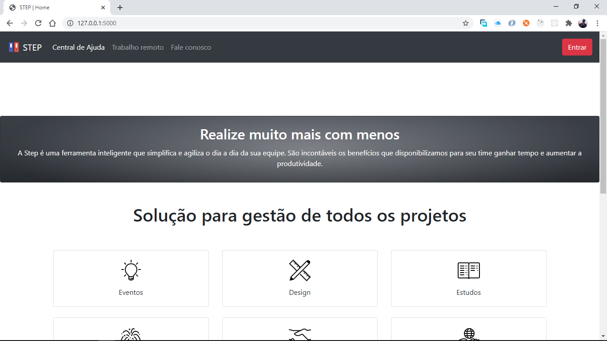
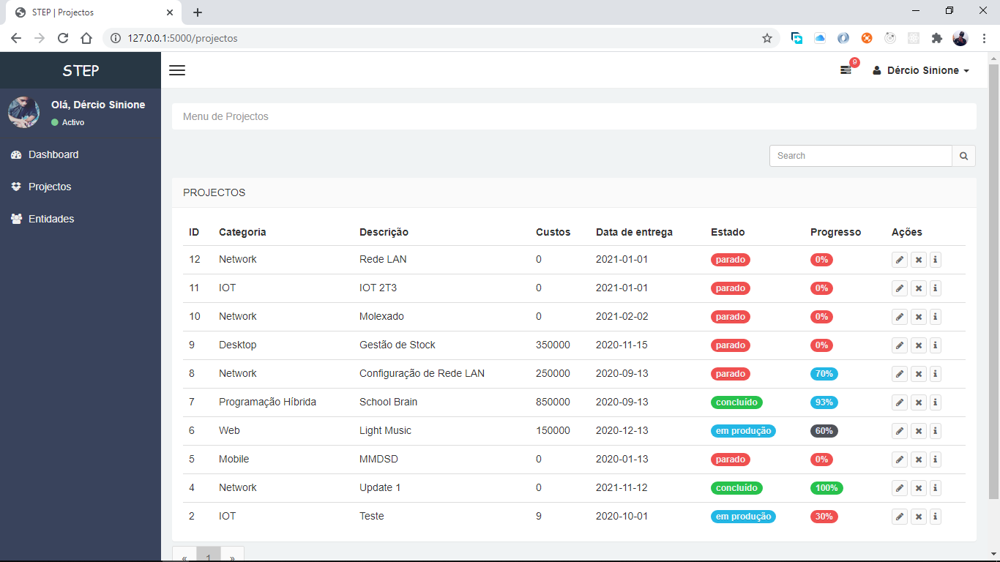
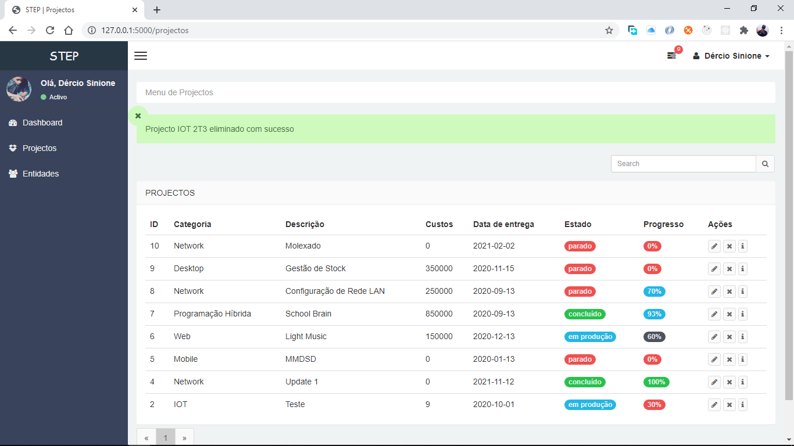
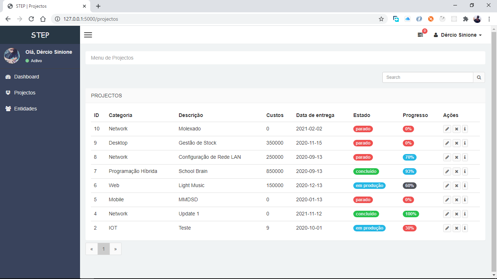
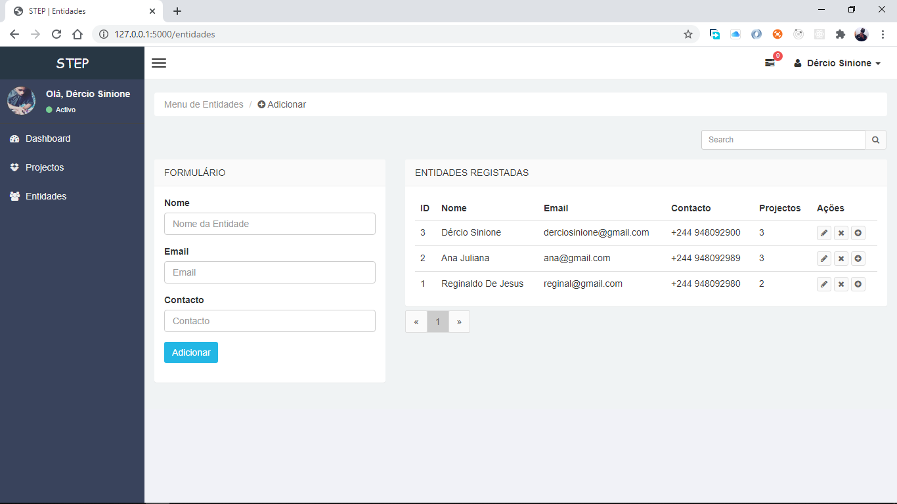
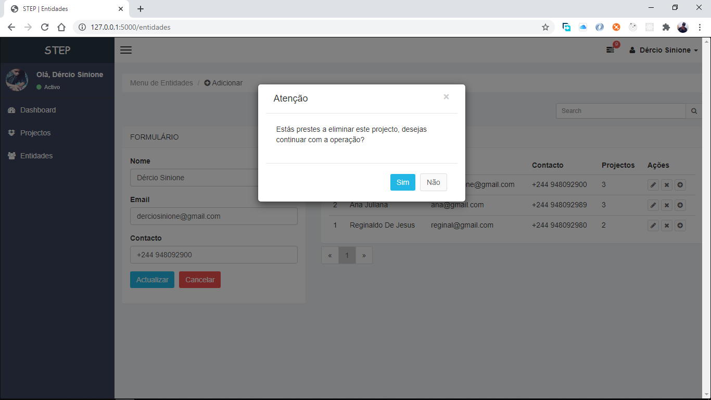
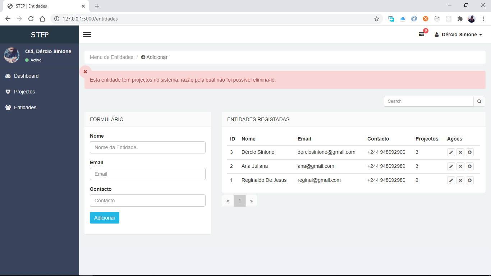
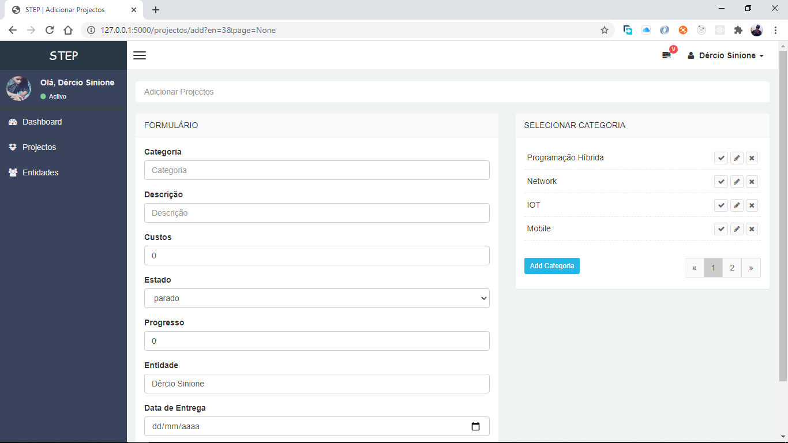

# Sistema de gestão de projetos

## Objetivo: Automatizar o processo de controle e gerenciamento de projetos. 

Pretende-se ter uma agenda que permitirá fazer o controle de fluxo de projectos a serem desenvolvidos, actualizar o estado e progresso do projecto. 

## Logo precisaremos das seguintes informações:

## Tipo de projecto
<ul>
<li>Descrição do projecto</li>

<li>
Entidade do projecto (informará a relação do projecto com uma determinada entidade, podendo ser um cliente ou uma disciplina relacionado com um professor)
</li>
<li>Custo</li>
<li>Estado do projecto (‘concluído’, ‘em produção’,’prado’)</li>
<li>Data para concluir ( informa a data de limite para concluir um projecto)</li>
<li>Data de registo </li>
<li>Data de conclusão </li>
<li>Dias de trabalho ( informa os dias que tens de trabalhar em cada projecto )</li>
</ul>

# Normalização
## Tabelas necessárias:
<ul>
<li>Usuário</li>
<li>Tipo de projecto</li>
<li>Entidade</li>
<li>Dias de trabalho</li>
<li>Projectos </li>
</ul>

### Usuário 
<ul>
<li>Id int</li>
<li>Nome string</li>
<li>Email string</li>
<li>Senha string</li>
<li>Imagem string</li>
</ul>

## Tipo de Projeto
<ul>
<li>Id int</li>
<li>Nome string</li>
<li>IdUsuario int</li>
</ul>

## Entidade
<ul>
<li>Id int</li>
<li>Nome string</li>
<li>Contacto sting</li>
<li>Email sting</li>
<li>IdUsuario int</li>
</ul>
 

## Projectos
<ul>
<li>Id int</li>
<li>IdTipoProjeto int</li>
<li>Descricao string</li>
<li>Custos int</li>
<li>Estado (‘concluído’, ‘em produção’,’prado’</li>
<li>DataEntrega date</li>
<li>DataRegisto date</li>
<li>DataConclusao date</li>
<li>IdUsuario int</li>
<li>IdEntidade int</li>
</ul>

## Dias de trabalho
<ul>
<li>Id int</li>
<li>IdProjecto int</li>
<li>Dia string</li>
<li>Hora time</li>
</ul>

## Modelo Entidade Relacionamento

## Gráfico de produtividade*

Pretende-se apresentar gráficos com as segintes característica:

<ul>
<li>Projetos em riscos</li>
<li>Projectos em produção </li>
<li>Projectos parados </li>
<li>Total de projectos</li>
</ul>

## Tecnologias usadas:
<ul>
    <li>Python</li>
    <li>Flask</li>
    <li>Bootstrap</li>
    <li>JavaScript</li>
</ul>

## Pacotes Python necessários:
    flask
    flask-sqlalchemy
    flask-Login
    flask-wtf
    email-validator
    Pillow 

## Usage
    Para rodar este projecto siga os seguintes passos:

    Abra o cmd/terminal e execute o comando:
        python run.py
    
    no teu navegador acesse este endereço : http://localhost:5000 or http://127.0.0.1:5000/

## Funcionamento
<ol>
<li>Criar uma conta</li>
<li>Fazer Login</li>
<li>Criar Entidades</li>
<li>Adicionar projecto a uma determinada entidade</li>
</ol>

# Suporte :
Se achaste este projecto interessante ou aprendeste alguma coisa e queres agradacer-me, considera em ajudar-ne a pagar a minha conta da internet. Isso me motivará a criar mais projectos.

# Screenshots : 

<ul>
    <li><a href="https://www.paypal.me/derciosinione"><b>PayPal</b></a></li>
</ul>